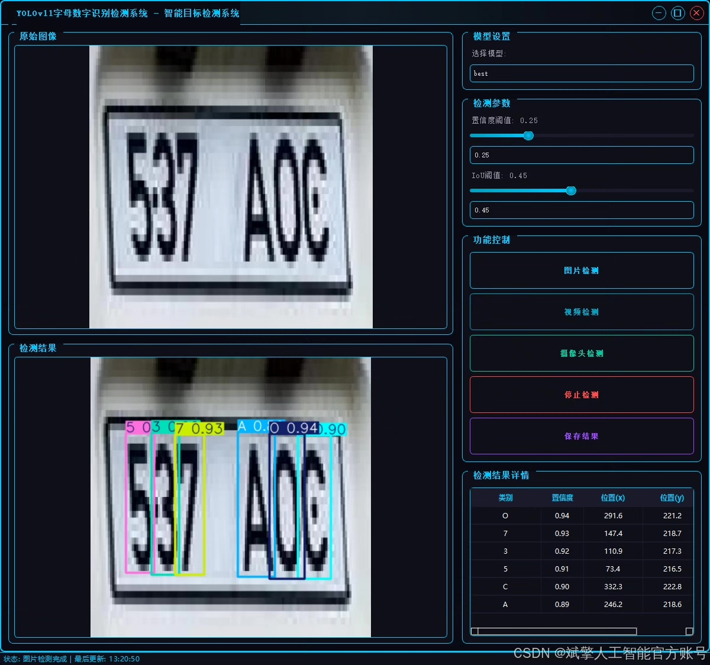
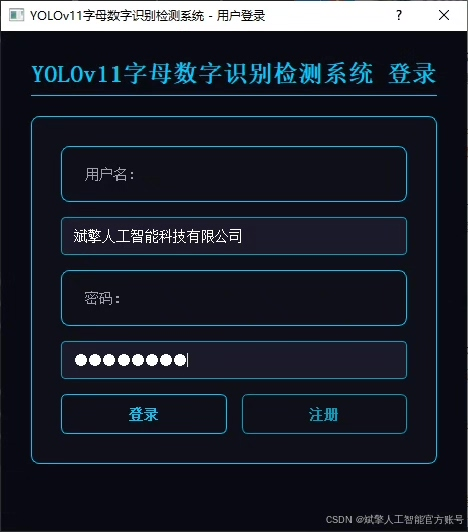
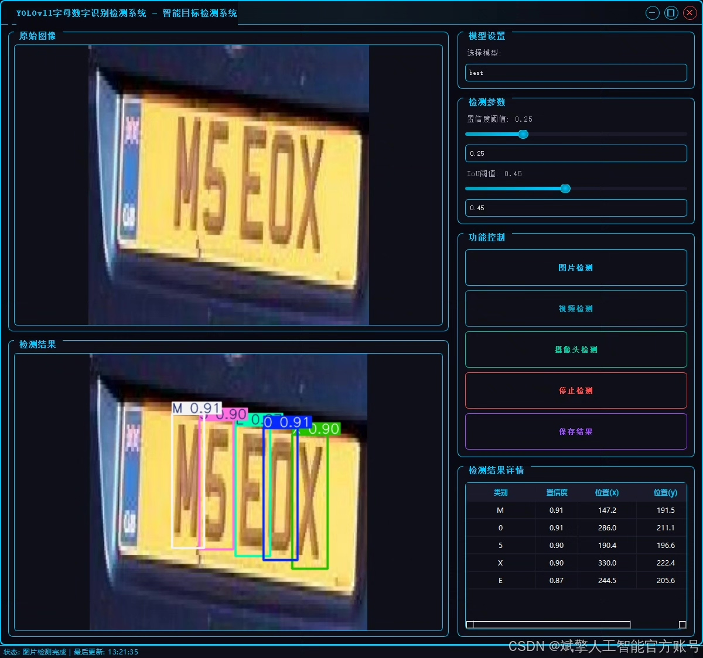
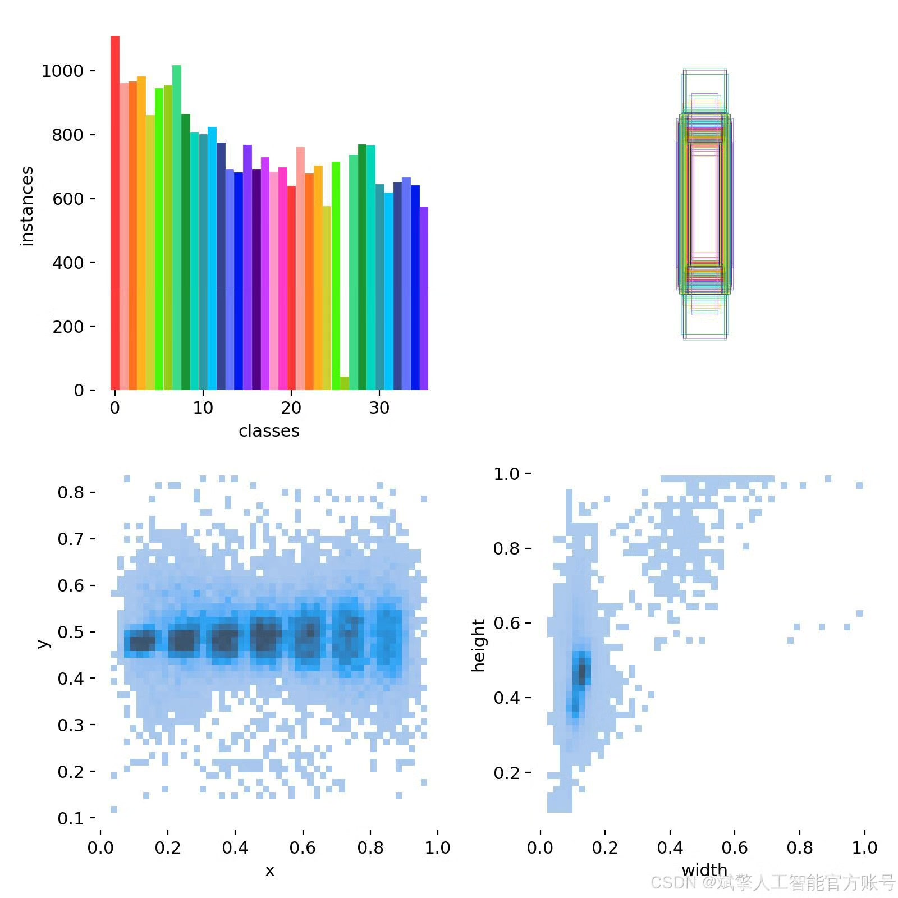
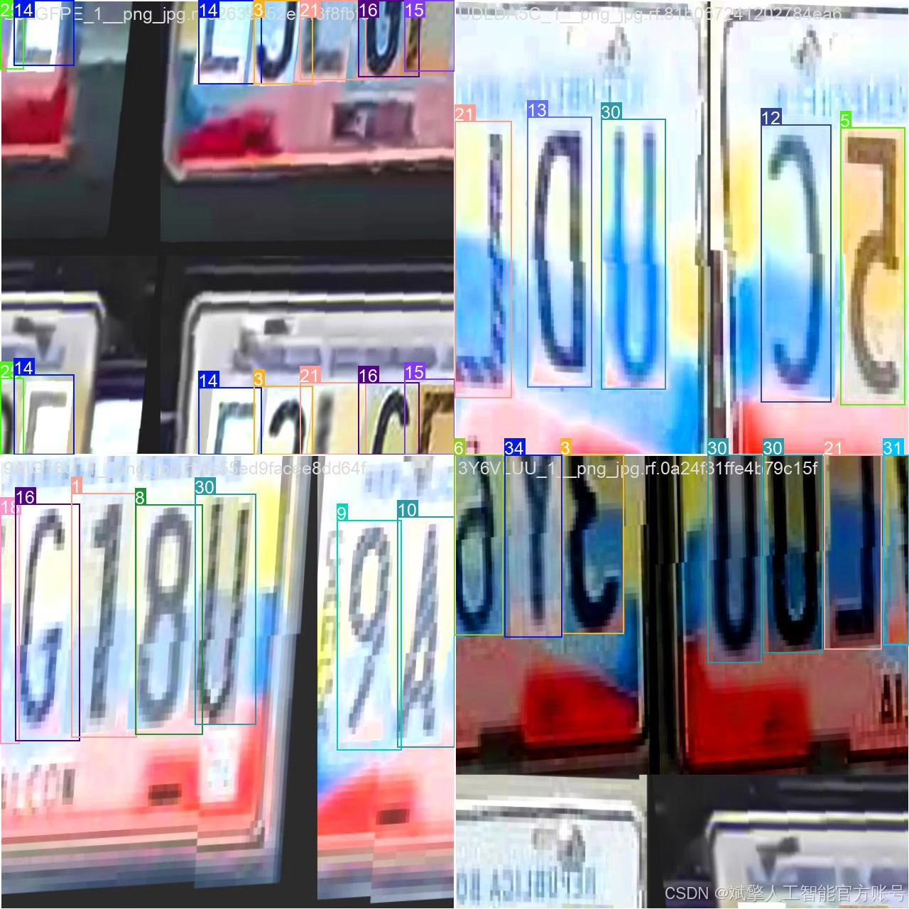
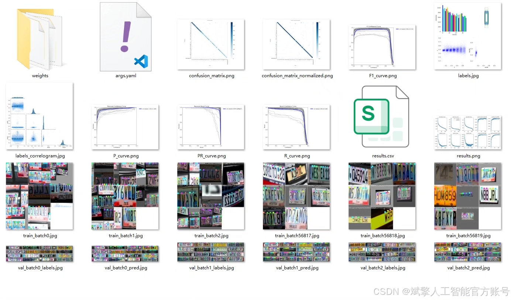
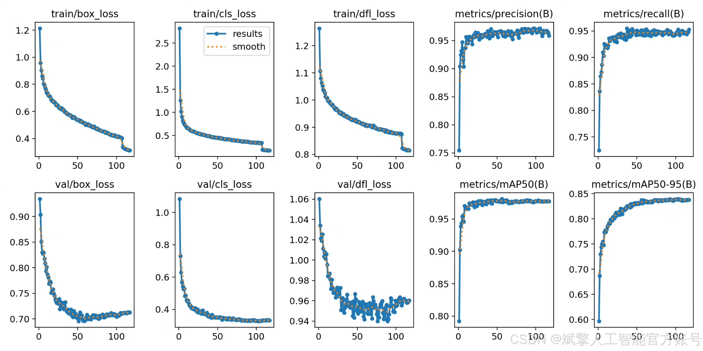
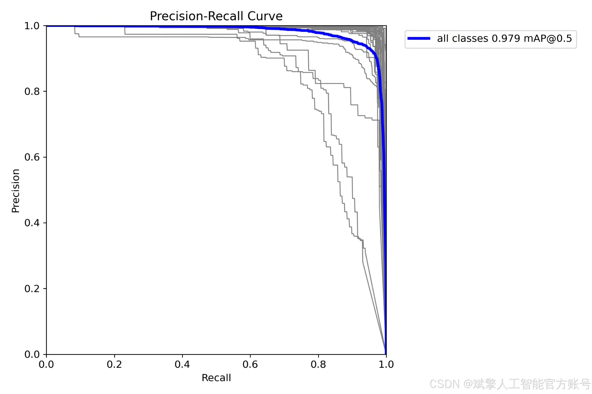
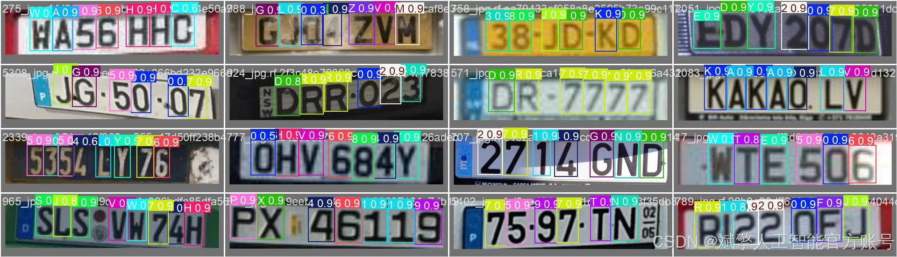

# YOLOv11 Alphanumeric Recognition System

## Body

YOLOv11 Letter and Number Recognition System Based on Deep Learning YOLOv11: A Letter and Number Recognition Detection System (YOLOv11+YOLO dataset + UI interface + login registration interface + Python project source code + model)

This paper proposes a letter and number recognition detection system based on deep learning YOLOv11, aiming to achieve efficient and accurate character detection and recognition. The system adopts an improved YOLOv11 algorithm, combined with the YOLO format dataset containing 36 classes of letters and numbers (0-9, A-Z). The dataset is scaled to include 4245 training images, 1221 validation images, and 610 test images. The system design includes a user-friendly UI interface, supports login registration functions, and completes the deployment of the entire project through Python. Experimental results show that the system has high detection accuracy and robustness in complex scenarios, and can be widely applied in fields such as license plate recognition and document automation processing. This paper details the optimization of algorithms, construction of datasets, system design, and performance evaluation processes, providing a reusable solution for character recognition tasks.

✅ User Login and Registration: Supports password verification and security validation.
✅ Three detection modes: Based on the YOLOv11 model, supporting image, video, and real-time camera detection, accurately recognizing targets.
✅ Dual-screen comparison: Display original images and detection results on the same screen.
✅ Data visualization: Real-time table displaying the category, confidence, and coordinates of detected targets.
✅ Intelligent parameter adjustment: Offers a confidence slide bar, dynamically optimizing detection accuracy to meet different scene requirements.
✅ Sci-fi style interactive interface: Dark theme paired with dynamic light effects, reducing visual fatigue and improving operational experience.

## Images

## Payment

Here is a pay link on Stripe ( https://buy.stripe.com/3cs8yP7sY87d0vu9AB ). Please contact me lonlonago@foxmail.com after funding $89, and I will send you a complete data files , thank you!

